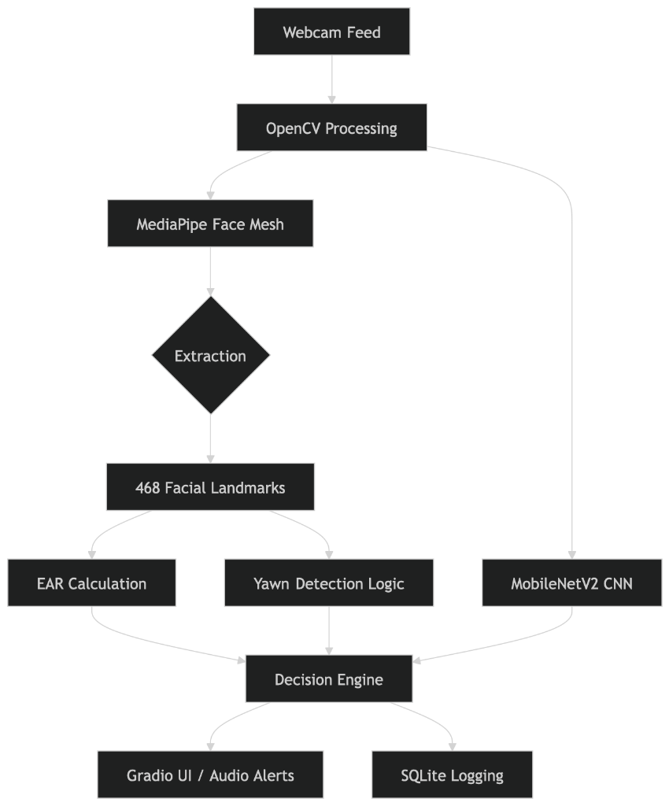

# FocusFleet: Driver Drowsiness Detection System 🚗💤

FocusFleet is a production-ready Driver Drowsiness Detection application designed to enhance road safety. It utilizes computer vision and machine learning to monitor driver attentiveness in real-time, providing both visual and audible alerts when signs of fatigue or distraction are detected.

---

## 🌟 Key Features

- **Real-time Monitoring**: High-performance video stream processing with non-blocking UI.
- **Intelligent Detection**: Uses Eye Aspect Ratio (EAR) and mouth gap analysis (yawn detection) via MediaPipe Face Mesh.
- **Custom ML Model**: Integrated TensorFlow/Keras model (`driver_drowsiness_model.keras`) for secondary validation of driver state.
- **State-Based Logging**: Event-driven logging system that avoids per-frame bloat, tracking sessions and state transitions (ACTIVE, WARNING, DROWSY, FACE_LOST, etc.).
- **Audible Alerts**: Automatic sound alerts triggered when the system confirms a drowsy state.
- **User Management**: Built-in SQLite database for driver registration and login.
- **Dual Deployment**: Optimized for both local Desktop usage (CustomTkinter) and Cloud deployment (Hugging Face Spaces + Gradio).
- **Image Classification**: Side-tab for manual image testing and classification.

---

## 🛠️ Tech Stack

- **Core Logic**: Python 3.10+
- **Deep Learning**: TensorFlow, Keras
- **Computer Vision**: OpenCV, MediaPipe
- **Local GUI**: CustomTkinter
- **Cloud Interface**: Gradio
- **Database**: SQLite
- **Audio**: Native OS calls (`afplay` for macOS, `winsound` for Windows)

---

## 📂 Project Structure

```bash
├── FocusFleet/               # Hugging Face Space deployment files
│   ├── app.py                # Gradio cloud application
│   ├── README.md             # HF Space metadata and docs
│   ├── requirements.txt      # Cloud dependencies (Python 3.10 optimized)
│   └── ...                   # Logic files (engine.py, logger.py, model)
├── app.py                    # Main Desktop Application (CustomTkinter)
├── engine.py                 # ML Inference Engine (MediaPipe + Keras)
├── logger.py                 # State Management and Session Logger
├── driver_drowsiness_model.keras # Pre-trained Keras Model
├── mi-gente-sountec-live-edit.mp3 # Alert Sound Asset
├── requirements.txt          # Local environment dependencies
└── driver.db                 # Local database storage
```

---

## 🚀 Getting Started

### Local Desktop App (MacOS/Windows/Linux)

1. **Clone the repository**:
   ```bash
   git clone <repository-url>
   cd driver_drowsiness_detection
   ```

2. **Create a virtual environment**:
   ```bash
   python -m venv venv
   source venv/bin/activate  # On Windows: venv\Scripts\activate
   ```

3. **Install dependencies**:
   ```bash
   pip install -r requirements.txt
   ```

4. **Run the application**:
   ```bash
   python app.py
   ```

### Hugging Face Space

The cloud version is located in the `FocusFleet/` directory and is optimized for Hugging Face's serverless infrastructure.

- **URL**: [https://huggingface.co/spaces/ArnavPoswal15/FocusFleet](https://huggingface.co/spaces/ArnavPoswal15/FocusFleet)
- **Deployment**: Any changes pushed to the `main` branch of the `FocusFleet` repo automatically trigger a rebuild.

---

## System Architecture & Data Flow



The application's data pipeline processes raw video frames through a multi-stage analysis:
- **Preprocessing**: OpenCV handles frame capture and initial transformation.
- **Landmark Extraction**: MediaPipe identifies 468 3D facial landmarks.
- **Biometric Metrics**: Eye Aspect Ratio (EAR) and yawning frequency (MAR) are calculated in real-time.
- **Deep Learning**: A MobileNetV2-based CNN provides secondary verification of the driver's state.
- **Decision Engine**: Flattens multiple inputs into actionable states (ACTIVE, WARNING, DROWSY).
- **Outputs**: Triggers UI updates, audio alerts, and persistent logging to SQLite.

---

## 📊 Detection Logic

The system follows a tiered detection approach:
1. **Face Mesh Extraction**: Locates 468 landmarks on the driver's face.
2. **Metric Calculation**:
   - **EAR (Eye Aspect Ratio)**: Calculates the ratio of vertical eye distances and horizontal intervals.
   - **MAR (Mouth Aspect Ratio)**: Monitors yawning frequency.
3. **State Machine**: Transitions through `ACTIVE` -> `WARNING` -> `DROWSY` based on persistent threshold violations.
4. **Alert Trigger**: If the state remains `DROWSY` for a defined duration, the `play_alert_sound()` function is called.

---

## 🤝 Contributing

Contributions are welcome! Please feel free to submit a Pull Request.

## 📄 License

This project is licensed under the MIT License.
